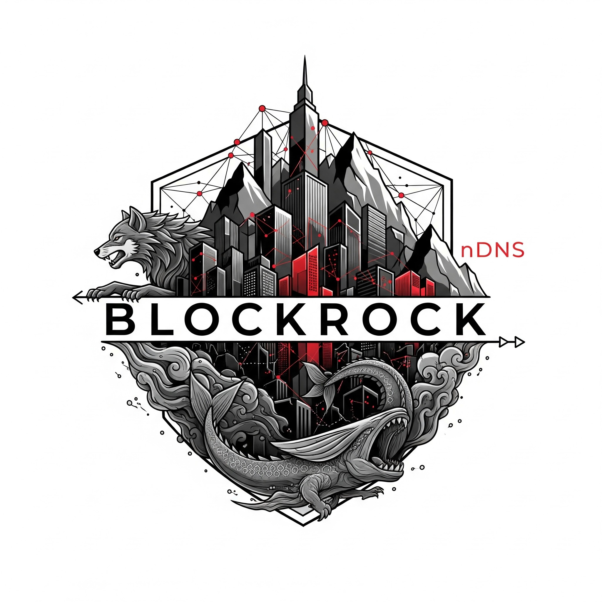

## 📁 Struttura del repository

```
BlockRock/
├── blockrock-core/
│   └── src/
│       └── ...
├── zion-core/
│   └── src/
│       └── ...
├── static/
│   └── index.html
├── docs/
│   ├── img/
│   │   └── Logo.jpg
│   └── ...
├── .gitignore
├── README.md
├── LICENSE.md
├── CONTRIBUTING.md
```

---

## 📝 Build & Setup

### Prerequisiti

- [Rust 1.76+](https://rustup.rs/)
- [Node.js](https://nodejs.org/) (solo per sviluppo frontend avanzato)
- [Android NDK r26b](https://developer.android.com/ndk/downloads) (per moduli Android)
- **Chiave TronGrid (Nile Testnet):**  
  Ottieni la tua API key gratuita su [TronGrid](https://www.trongrid.io/)

### Setup rapido

`git clone https://github.com/BlockRockAdmin/BlockRock.git`  
`cd BlockRock`

Build blockrock-core (blockchain)  
`cd blockrock-core`  
`cargo build`

Build e lancia zion-core (orchestratore)  
`cd ../zion-core`  
`cargo build`  
`export TRONGRIDAPIKEY=la_tua_api_key` `# Imposta la chiave TronGrid`  
`cargo run`

text

**Dashboard web:**  
Apri [http://localhost:8000/static/index.html](http://localhost:8000/static/index.html)  
(o sostituisci `localhost` con l’IP della tua macchina se accedi da remoto).

---

## 🛠️ Troubleshooting

- **NaN TRX nella dashboard:**  
  Verifica che la variabile d’ambiente `TRONGRIDAPIKEY` sia impostata e che l’indirizzo TRON sia valido.
- **Errore “static non trovato” all’avvio:**  
  Crea la cartella `static/` dentro `zion-core` e inserisci `index.html`.
- **Errore di build su Rocket/libp2p:**  
  Assicurati di usare Rust 1.76+ e le versioni indicate in `Cargo.toml`.

---

## 📚 Licenza

BlockRock è rilasciato sotto licenza [MIT](https://github.com/BlockRockAdmin/BlockRock/blob/main/LICENSE.md).

---

## 🤝 Contribuire

BlockRock è guidato dalla community e **i contributi sono benvenuti** (ma preferiamo le donazioni! [💸](https://github.com/sponsors/BlockRockAdmin)).

1. Fai un fork del repository.
2. Crea un branch descrittivo (es. `feature-miglioramenti-gps`).
3. Committa con messaggi chiari.
4. Apri una Pull Request.
5. Consulta il file [CONTRIBUTING.md](https://github.com/BlockRockAdmin/BlockRock/blob/main/CONTRIBUTING.md) per dettagli.

---

## 📬 Contatti & Community

- [Wiki](https://github.com/BlockRockAdmin/BlockRock/wiki)
- [GitHub Issues](https://github.com/BlockRockAdmin/BlockRock/issues)
- [GitHub Sponsors](https://github.com/sponsors/BlockRockAdmin)

---

> BlockRock: Forgia il tuo destino nella blockchain sostenibile!
